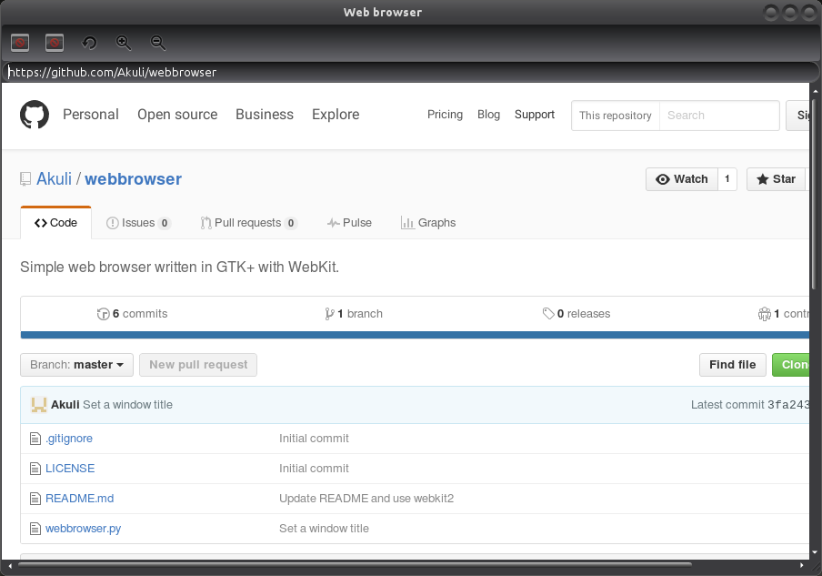

# Webbrowser

This is a simple web browser written in GTK+ with WebKit.

You need to install GTK+ and WebKit for it. On Debian-based GNU/Linux
distributions such as Ubuntu and Linux Mint, you can run this on a
terminal:

    sudo apt-get install python3-gi gir1.2-{gtk,webkit}-3.0

Or you can install webkit2 instead:

    sudo apt-get install python3-gi gir1.2-{gtk,webkit2}-3.0

Then simply run webbrowser.py in python3, or `chmod +x` it and run
`./webbrowser.py`.
